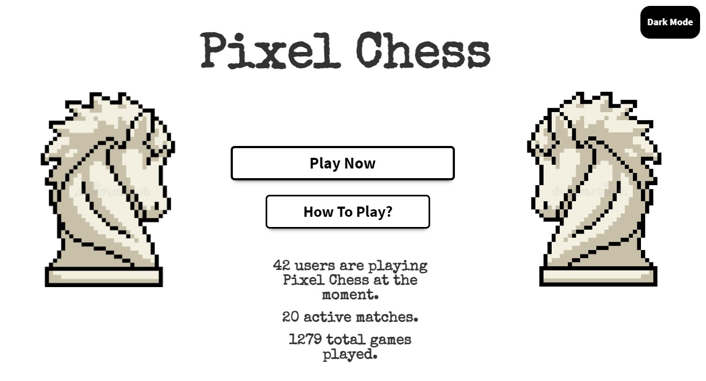
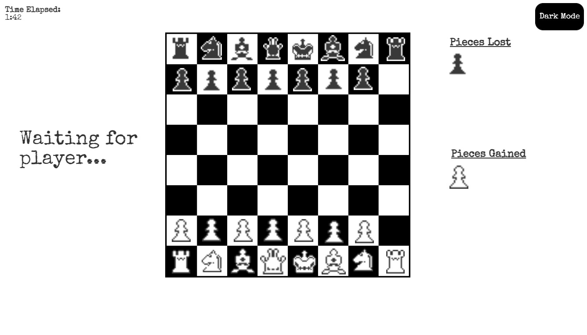

# pixel-chess
An online chess game created with Node.js and Websockets, powered by [chess.js](https://github.com/jhlywa/chess.js/).

## Initial mockups
### Splash

### Game


## Want to try it yourself?
```
$ git clone https://github.com/Vel1khan/pixel-chess.git
$ cd pixel-chess
$ cd pixel-chess
$ npm install
$ npm start
```
#### By default, it will be accessible on localhost:3000. To change the port, access package.json and modify: 
``` 
"scripts": {"start": "node app.js portnumber"}, 
```

## Credits
* Vel1khan
* Zaheu
* Ahmet Donmez (Planning & Mockup Design)
